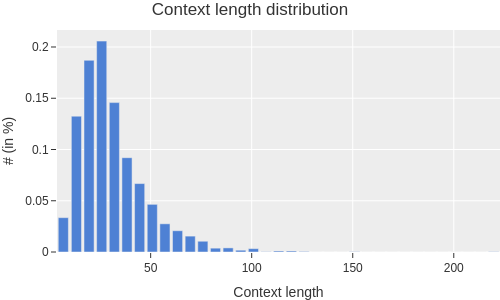
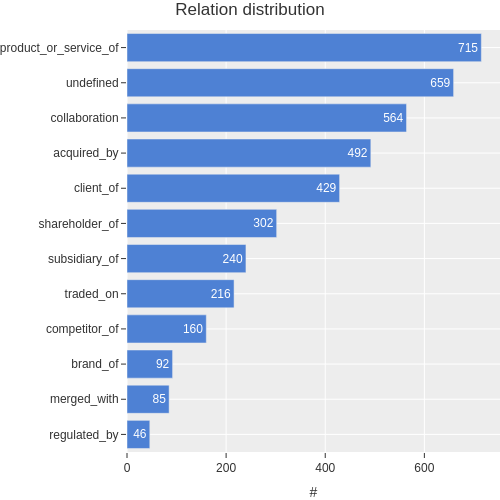

# CORE: A Few-Shot Company Relation Classification Dataset for Robust Domain Adaptation.

# Abstract
We introduce CORE, a dataset for few-shot relation classification (RC) focused on company relations and business entities. CORE includes 4,708 instances of 12 relation types with corresponding textual evidence extracted from company Wikipedia pages. Company names and business entities pose a challenge for few-shot RC models due to the rich and diverse information associated with them. For example, a company name may represent the legal entity, products, people, or business divisions depending on the context. Therefore, deriving the relation type between entities is highly dependent on textual context. To evaluate the performance of state-of-the-art RC models on the CORE dataset, we conduct experiments in the few-shot domain adaptation setting. Our results reveal substantial performance gaps, confirming that models trained on different domains struggle to adapt to CORE. Interestingly, we find that models trained on CORE showcase improved out-of-domain performance, which highlights the importance of high-quality data for robust domain adaptation. Specifically, the information richness embedded in business entities allows models to focus on contextual nuances, reducing their reliance on superficial clues such as relation-specific verbs.

# Overview
The CORE dataset is provided in the `dataset` folder, which includes both the train and test sets required to recreate our episode sampling procedure. The dataset consists of the following attributes:

- `context`: Tokenized text passages extracted from company Wikipedia pages.
- `relation`: Relation type between e1 and e2 described in the context.
- `e1_name` and `e2_name`: Concatenated tokens corresponding to entities e1 and e2.
- `e1_start` and `e1_end` (`e2_start` and `e2_end`): Position markers indicating the start and end tokens of the entities in the context.

The order of e1 and e2 is based on their occurrence in the context. The `invert_relation` field indicates whether the entity positions are inverted, such as changing from $(e1,r,e2)$ to $(e2,r,e1)$.

<center>


</center>


# Benchmark
The `benchmark` folder contains scripts and files required to reproduce the performance benchmark presented in the paper. The `mapping.json` and `template.json` files in the `benchmark/data` folder are used to train the prompt-tuning models and are included for all benchmarked datasets.

In the following sections, we provide code snippets that can be used to reproduce our benchmark.

## Configuration
The sampling procedure is adjusted to accommodate overlapping relation types in the dedicated training and test sets. We sample disjoint sets of relation types $r_{train} \cap r_{test} = \varnothing$ for training and test episodes for multiple seeds:

```bash
TASK="core"
N=5

python fs/sample_configuration.py \
--task_name $TASK \
--N $N \
--include_na \
--seeds 41 42 43 44 45
```
> By default, this creates an `episodes` folder in the data directory.

## Training

To reproduce the model benchmark, you can use the `fs_run.py` script. The selected input arguments are described below:

- `task_name`: Defines the dataset used for training or evaluation. The implemented choices are "core", "tacred," and "fewrel."
- `model_name`:The implemented choices are "proto," "bertem," "bertpair,", "bertprompt" and "hcrp".
- `encoder`: The default encoder is "bert-base-uncased".
- `lr`: The default learning rate is defined as 2e-5.
- `seed`: Defines the dataset configuration to be loaded.
- `N`: Number of support relations. This must correspond to the N in the dataset configuration.
- `K`: Number of support instances per relation. This must correspond to the K in the dataset configuration.
- `Q`: Number of query instances.  
- `sampling`: The implemented choices are "random" and "uniform." By default, query instances are randomly sampled from the test set. For "uniform," K instances are uniformly sampled from each of the N relations.
- `na_rate`: 
    - For `sampling="random"` this argument adds $Q*na rate$ randomly sampled instances to the query set.
    - For `sampling="uniform"` this argument adds $Q*na rate$ instances from the NOTA category to the query set. 
- `ckpt`: Path to the trained model checkpoint.
- `eval_only`: Only evaluate the model.
- `fs_seed`: For the "bertprompt" model this seed determines the fine-tuning examples used for few-shot evaluation.

The code snippet below starts the training a $BERT_{EM}$ model in the 5-Way 1-Shot evaluation setting. [BERT-Base uncased](https://huggingface.co/bert-base-uncased) is defined as the default encoder.

```bash
N=5
K=1
Q=1
SEED=42
MODEL="bertem"

python fs_run.py \
--model_name $MODEL \
--do_lower_case \
--N $N \
--K $K \
--Q $Q \
--seed $SEED
```

## Domain Adaptation
We evaluate the $BERT_{EM}$ model trained on one of the CORE configurations in the domain adaptation setting on TACRED. In the first step, we create dataset configuration files for TACRED:

Step 1: Create dataset configuration files for TACRED:

```bash
TASK="tacred"
N=5

python fs/sample_configuration.py \
--task_name $TASK \
--N $N \
--include_na \
--seeds 41 42 43 44 45
```
Step 2: Provide the path to the model checkpoint `ckpt`, the dataset name `task_name`, corresponding seeds, and the `eval_only` flag:

```bash
TASK="tacred"
N=5
K=1
Q=1
SEED=42
MODEL="bertem"
CKPT="runs/core/${MODEL}/NA2_random/${MODEL}_${N}_${K}_${SEED}"

for EVAL_SEED in 41 42 43 44 45
do
    python fs_run.py \
    --model_name $MODEL \
    --do_lower_case \
    --N $N \
    --K $K \
    --Q $Q \
    --seed $EVAL_SEED \
    --task_name $TASK \
    --wandb_project $TASK \
    --ckpt $CKPT \
    --eval_only
done
```

# References
```bibtex
```

# Terms Of Use

[](https://creativecommons.org/licenses/by/4.0/)